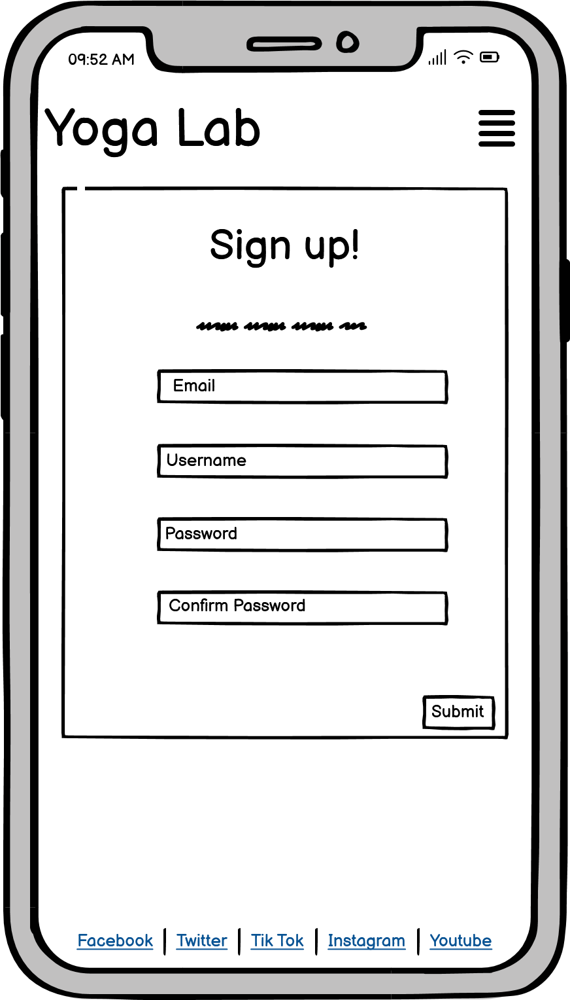
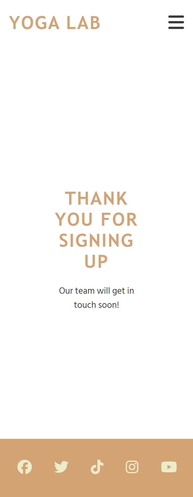

Welcome to the Yoga Lab website, the following ReadMe contains useful information about the website. The site is responsive for all screen sizes.

**Contents**
 - [Description](#description)
 - [Wireframes](#wireframes)
 - [Final screenshots](#final-design)
 - [Features](#features)
 - [How to use](#how-to-use)
 - [Testing](#testing)
 - [Bugs](#bugs)
 - [Features I would add in the future](#features-i-would-add-in-the-future)
 - [Deployment](#deployment)
 - [Credits](#credit)

## Description
This website is designed to promote yoga, body and mind training, and fitness, catering to both men and women. It aims to provide valuable information about the benefits of yoga and encourage a healthy lifestyle through regular practice.

## Wireframes

Balsamiq was used to design and develop this website. I used the wireframe tools to visualise my ideas and create the fundamental structural layouts for this website. 

PC View: 

Home:

About:

Sign Up:

Thank you:

Mobile View:

Home:

About:

 

Sign Up:

Thank you: 

## Final Design

The website closely adheres to the original wireframe plan, ensuring that the design closely aligns with the initial conceptualization. This approach emphasizes consistency between the envisioned layout and the final implementation of the website.

PC View:

Home Page:

About Page: 

Sign Up Page: 

Thank You Page:

Mobile View:

Home Page:

About Page:

Sign Up Page:

Thank You Page:

## Features
* Icons have been used to enhance the site design, giving a yoga icon located in favicon

* The Header
 -  Fixed at the top of the page, with link to home page, there is a company logo that appears on every page. 

* Menu Navigation Bar
 -   Featured at the top of all three pages, the navigation links are situated to the right. 
 -  On larger screens they show the text; Home, Services and Contact. On smaller screens, such as mobiles, the navigation links are situated in the burger-icon that expands when you click it.
 
 

 - When hovered over links the heighlighted link, it changes color to interact with user. On smaller devices it changes color when being clicked.

 

* The Body
 - Image: This serves as a visually engaging focal point, illustrating the essence of Yoga Lab's ethos. It conveys a sense of tranquility and mindfulness while inviting visitors to explore the transformative journey offered by Yoga Lab.

 - Educational Content: Detailed information about various yoga exercises, their benefits, and their impact on physical and mental health.

 - Video Demonstrations: Videos demonstrating different yoga poses and routines to help users understand and practice effectively.
 The video media can be easily controlled by the user, with the play, pause and mute option.

 - Table: Displays the weekly schedule of opening days.

 

* The Footer 
 - Social Media Integration: Links to various social media platforms to engage with the Yoga Lab community and stay updated on events and news.

 

* About 
- Our Story: Yoga Lab's journey, reflecting its evolution, values, and commitment to promoting holistic well-being through yoga.

- Our Philosophy: Yoga Lab's holistic approach to yoga, emphasizing its role not just as physical exercise but as a lifestyle encompassing breathwork, meditation, and mindfulness to foster balance and inner peace in modern life.

- Our Commitment: highlights the dedication to providing high-quality yoga instruction, fostering community, and promoting overall well-being through accessible classes, workshops, and events.

- Join Our Community: invitation for individuals to become part of a supportive and inclusive network focused on holistic wellness and personal growth through yoga practice.

- Location: Information about the physical location of Yoga Lab using a photo image, making it easier for users to find and visit.

* Sign Up
- The Sign Up page enables users to register as members of Yoga Lab by inputting essential details like email, username, and password, featuring validation for mandatory fields, password confirmation, and a registration submit button, Upon submitting the required information, users are redirected to the index.html page. Additionally, clicking on each input triggers a color change and slides the text to the top left corner for enhanced user interaction. 

 ## How to Use
 - Navigation: Use the navigation menu to explore different sections of the website, including Home, About Us, and Contact.
 - Content: Read articles, watch videos, and learn about the benefits of yoga.
 - Contact: Reach out through the provided sign up form or connect via social media for inquiries or feedback.

 ## Testing
 * Accessibility

 

 * W3C HTML Validator: No errors found:

 

 * W3C CSS Validator (Jigsaw): No errors found

  **Links**:
 - I tested and confirmed that all internal links are working and redirecting the user between the pages.
 - I tested that all external links, to social media sites, are woking and opening in a separate tab.
 - I tested and confirm that the sign up form works, all fields are required and the email field only accepts email address, and the submit button link works which direct users to the home page.

 ## Bugs

 - Hero image did not work, I resolved this by using the IMG tag which fixed it.
 - Image was taking the full width of the screen, resolved by setting the max-with of the header to 1080px.
 - Menu was not responsive when switched to tablet screens, resolved by changing to display: block.
 - Video on home page was not responsive on smaller screens, resolved by changing the max-width: 100% and height: auto.

 * Unresolved bugs:
 - There are no unresolved bugs

## Features I would add in the future
- Interactive yoga tutorials or guided sessions.
- A blog or news section for sharing updates and articles related to yoga and wellness.
- Online store functionality for selling yoga-related products or merchandise.
- Integration with a scheduling system for booking yoga sessions.
- User authentication and account management system for personalized experiences.

## Deployment
The following steps were taken to deploy the site:

- The project was originally setup in an online repository on GitHub and a workspace opened in GitPod.
- Using VSCode, the project was edited in a local dev area. 
  I used the git commands regularly, 
  1. After making changes to my project files, I used (git add .) to stage all the changes for commit.
  2. Once changes are staged, I commit them to the repository with (git commit -m "message") replacing "message"    with a descriptive commit message that explains the changes I have made.
  3. After committing my changes, I push them to a remote repository in GitHub using (git push).
- Throughout development, regular commits were added with descriptive commit messages.
- These commits were pushed to GitHub at least daily.
- It was deployed to a live server on gitpages.
- Under settings/pages, main branch was selected as the source.
- Link to live site: [YOGA LAB](https://ojarvey.github.io/Project-1-Yoga-Lab-/index.html)

## Credit
- Code used for header and overlay text, borrowed and modified from Code Institute Love Running project.
- Code used for footer section borrowed and modified from Code Institute Love Running project. 
- Form page credit[freecodecamp.org](https://www.freecodecamp.org).
- Photo used in home page is credited to Photo by Andrea Piacquadio from [Pexels.com:](https://www.pexels.com).
- Videos are credited to Yan Krukau from Pexels and cottonbro studio from Pexels [Pexels.com:](https://www.pexels.com).
- Favicon is credited to [flaticon.com](https://www.flaticon.com/free-icons/yoga).
- FontAwesome icons from [font awesome](https://fontawesome.com)
- I would like to extend my sincere appreciation to my mentor for their invaluable guidance and support throughout the development of this project. Their expertise, encouragement, and insightful feedback have been instrumental in shaping the outcome of this work. I am truly grateful for their mentorship.

